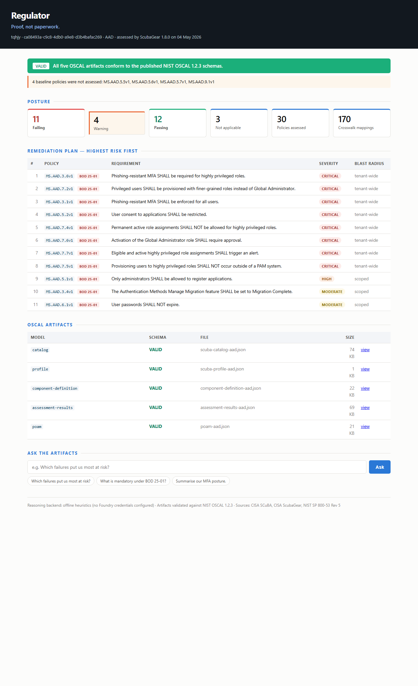
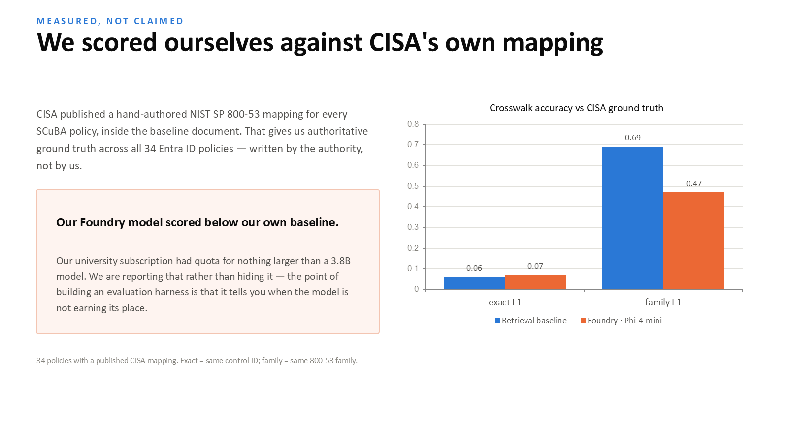

# Regulator

**Proof, not paperwork.**

Turns CISA SCuBA guidance and ScubaGear assessment results into validated
NIST OSCAL evidence, then lets you query it in plain English.

Built for the **Microsoft & CCI Innovation Challenge for Virginia**,
Executive Challenge 1 — *SCuBA Security Application*.

---

## The problem

Every US federal civilian agency is legally required under
[CISA BOD 25-01](https://www.cisa.gov/news-events/directives/bod-25-01-implementing-secure-practices-cloud-services)
(issued 17 December 2024) to assess its Microsoft 365 tenants against CISA's
SCuBA Secure Configuration Baselines using
[ScubaGear](https://github.com/cisagov/ScubaGear). The deadlines — tenants
identified by 21 Feb 2025, tools deployed by 25 Apr 2025, mandatory policies
implemented by 20 Jun 2025 — have already passed.

ScubaGear does the hard part well. But the chain terminates in an **HTML
report**: readable by a person, opaque to a machine. So agencies cannot
aggregate results across tenants, cannot reuse the findings as evidence for
their NIST SP 800-53 obligations, cannot detect posture drift between runs, and
cannot answer *"are we compliant, and what do we fix first?"* without days of
analyst time.

## What Regulator does

```
SCuBA baselines ──┐
                  ├──▶ parse ──▶ retrieve ──▶ AI judgements ──▶ render ──▶ VALIDATE
ScubaGear JSON ───┘                                                          │
                                                                             ▼
NIST SP 800-53 ──────────────────────────────────────────▶  NIST OSCAL schemas
```

Five OSCAL artifacts — the full compliance lifecycle:

| Artifact | Built from | Contains |
|---|---|---|
| **Catalog** | SCuBA baseline markdown | every policy as an addressable control |
| **Profile** | a selection | the full baseline, or only BOD 25-01 mandatory policies |
| **Component Definition** | product metadata | how Entra ID implements each control |
| **Assessment Results** | ScubaGear JSON | observations, findings, risks |
| **POA&M** | failed findings | ranked remediation plan with effort and owner |

Plus an AI layer that maps policies onto NIST SP 800-53, ranks failures by real
risk, drafts remediation, and answers questions with verified citations.

## Two design decisions that matter

**The model supplies judgement; code supplies structure.**
Agents never emit OSCAL. They return small typed judgements — a mapping, a
severity, a list of steps — and deterministic code renders the documents. So
output is schema-valid by construction, and re-running over the same input
produces byte-identical artifacts, which an audit artifact has to.

**A hallucinated control reference cannot reach an artifact.**
Every control ID an agent proposes is checked against the real SP 800-53 catalog
(1,196 controls) before it is allowed through. That guarantee comes from code,
not from prompt wording. The same applies to citations in query answers:
unverifiable ones are stripped and reported separately.

## Quick start

```bash
uv venv && uv pip install -e ".[dev]"

# Build all five artifacts from CISA's own published sample ScubaGear report
python -m regulator.cli build data/sources/scubagear/ScubaResults-sample.json --out artifacts

# Validate any artifact against the published NIST schema (exit 1 if invalid)
python -m regulator.cli validate artifacts/poam-aad.json --model poam

# Score the crosswalk against CISA's own published NIST mapping
python -m regulator.cli evaluate --product AAD

# Ask a question
python -m regulator.cli query "Which failures put us most at risk?" \
  --source data/sources/scubagear/ScubaResults-sample.json

# Dashboard at http://127.0.0.1:8000
python -m regulator.cli serve --source data/sources/scubagear/ScubaResults-sample.json
```

Everything above runs **with no cloud credentials and no network**, against real
public CISA and NIST data committed to this repository.



## Deployment

The dashboard runs as an ordinary ASGI app and needs **no credentials** — it
serves the public CISA sample report committed here, so a reviewer can open it
and click without an account:

```bash
PYTHONPATH=src python -m uvicorn regulator.asgi:app --host 0.0.0.0 --port 8000
```

See [DEPLOY.md](DEPLOY.md) for Azure App Service and custom-domain setup.

## Microsoft Foundry

Set these three variables and the four agents switch from the offline baseline to
a Microsoft Foundry model deployment — no other change:

```bash
AZURE_OPENAI_ENDPOINT=https://<resource>.services.ai.azure.com
AZURE_OPENAI_API_KEY=<key>
AZURE_OPENAI_DEPLOYMENT=<deployment-name>
```

Foundry serverless endpoints and other OpenAI-compatible gateways use a plain
base URL instead of Azure OpenAI's deployment-routed URLs, so those are supported
too:

```bash
MODEL_ENDPOINT=<endpoint>
MODEL_API_KEY=<key>
MODEL_NAME=<model>
```

`build` prints which backend it used, and the dashboard names it in the footer.
Provenance is never hidden.

## Evaluation

CISA publishes a hand-authored SP 800-53 mapping for each SCuBA policy inside the
baseline document. Regulator uses that as **ground truth** — an authoritative
reference set covering all 34 Entra ID policies, produced by the authority rather
than by us.

The offline baseline deliberately never sees that mapping, so the comparison is
honest:

| Backend | exact F1 | family F1 | family hit-rate |
|---|---|---|---|
| Retrieval baseline | 0.06 | **0.69** | 91% |
| Microsoft Foundry · Phi-4-mini | 0.07 | 0.47 | 71% |

Both a strict and a forgiving score are always reported. Exact matching treats
`ia-2` as wrong when CISA wrote `ia-2(1)`; family matching gives partial credit
for a near miss. Publishing only the flattering figure would be dishonest.

**Our Foundry deployment scored below the retrieval baseline, and we report it.**
Quota limits confined us to a 3.8B-parameter model, and the point of building an
evaluation harness is that it tells you when the model is not earning its place.



## Tests

```bash
python -m pytest
```

194 tests, written test-first. The headline one validates **NIST's own SP 800-53
catalog against NIST's own schema** using our validator — if that fails, the
validator is broken, not the document.

## Two OSCAL gotchas, handled

Worth knowing if you build on OSCAL yourself:

1. **`$id` on subschemas.** The published schemas set `$id` on nested
   subschemas, which resets the JSON Schema resolution base and breaks every
   sibling `#/definitions/...` reference. They are stripped before use.
2. **ECMA-262 regex.** OSCAL patterns use Unicode property escapes (`\p{L}`)
   that Python's `re` cannot compile. The `pattern` keyword is reimplemented on
   the `regex` module rather than weakened or skipped.

## Layout

```
src/regulator/
  parsers/          SCuBA baseline markdown, ScubaGear JSON
  oscal/            the five artifact renderers
  agents/           provider protocols, offline baseline, Foundry, crosswalk engine
  families.py       SCuBA subject matter -> 800-53 control families
  nist_catalog.py   SP 800-53 index and hallucination guard
  validation.py     NIST schema validation
  evaluation.py     crosswalk scoring against CISA ground truth
  pipeline.py       orchestration
  query.py          natural-language querying with citation enforcement
  cli.py  web.py
data/
  schemas/          NIST OSCAL 1.2.3 schemas
  sources/          SCuBA baselines, ScubaGear sample, SP 800-53 catalog
```

## Sources

All public, all committed to this repository:

- CISA SCuBA baselines and ScubaGear — <https://github.com/cisagov/ScubaGear>
- NIST OSCAL 1.2.3 schemas — <https://github.com/usnistgov/OSCAL>
- NIST SP 800-53 Rev 5 in OSCAL — <https://github.com/usnistgov/oscal-content>
- CISA BOD 25-01 — <https://www.cisa.gov/news-events/directives/bod-25-01-implementing-secure-practices-cloud-services>

## Scope

Microsoft Entra ID, end to end. The architecture is product-agnostic — parsers
and renderers work from the product abbreviation — but only the Entra ID baseline
is committed and exercised. Depth on one beats a thin pass over seven.

Not built: drift detection between assessments, System Security Plan, and
Assessment Plan. Regulator also never connects to a tenant — it consumes the
output ScubaGear already produces.
